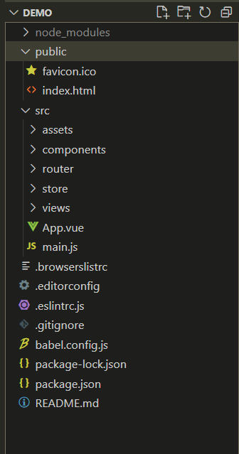

# vue 开发多页面应用

## 单页面应用和多页面应用

两者的区别：


当前前端项目多以单页面为主，但多页面也并非一无是处，在一些情况下也是使用多页面的，比如：

- 项目庞大，各个业务模块需要解耦
- SEO更容易优化
- 没有复杂的状态管理问题
- 可以实现页面单独上线

## 使用 vue 开发多页面应用

使用 vuecli 创建的 vue 项目均为单页面应用。但是有时候我们也需要多页面应用，那该如何使用 cli 来配置多页面工程。

### 1 创建工程

使用 CLI 创建 vue 工程，此时的工程是一个单页面的 vue 工程。

  ```bash
  vue create demo
  ```

此时，单页面的目录结构：



## 2 更改项目目录结构

在 src 文件夹下新建 pages 文件夹

## 3 修改 vue.config.js
