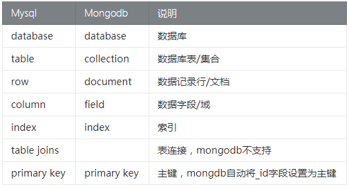

# MongoDB

mongodb（芒果数据库）

## 1.介绍

Mongodb 是一个介于关系数据库和非关系数据库之间的产品(Nosql)，是非关系数据库当中功能最丰富，最像关系数据库的（在学习的时候有一种在学 mysql 的感觉），_语法有点类似**javascript**面向对象的查询语言（又有一种在学习 JavaScript 的感觉）_，它是一个面向集合的，模式自由的文档型数据库。Mongodb 数据库旨在为 WEB 应用提供可扩展的高性能数据存储解决方案。

> - MongoDB 是一个数据库
> - 操作语法有点像 JavaScript 的面向对象写法

- 关系型数据库和非关系型数据库结构区别



**mongodb 数据体系:**


上图所表达的含义：

- 一个数据库中可以包含多个 collection（集合或者叫表），例如 admin、user
- 一个 collection 里可以包含多个 document，例如管理员 1，管理员 2，用户 1，用户 2

MongoDB 数据模型是面向文档的，所谓的文档是一种类似 json 的结构，简单理解就是 MongoDB 这个数据库存的就是各种 JSON(实际是 BSON)。

MongoDB 数据库结构:库，表（集合），行（文档），列（字段，域），主键（primary key）。库包含表，表包含文档。

## 2.安装

安装并配置环境变量

- 官方下载地址：<https://www.mongodb.com/try/download>
- 分为社区版和企业版，偶数为稳定版，奇数为开发版

安装完后需要手动配置环境变量：计算机-属性-高级系统设置-环境变量

在 cmd 进入 D:\MongoDB\bin 目录下，然后执行

- `mongod -dbpath D:\MongoDB\data\db`
- `mongo`

这条命令是开启服务，它会一直运行，只要你要使用 Mongodb，这个窗口就不能关）

[最详细的安装教程](https://www.cnblogs.com/TM0831/p/10606624.html)

## 3.基本操作指令

打开 cmd 在命令行中输入命令

```bash
#退出mongoDB使用
exit

#查看所有的数据库列表
show dbs

#创建数据库或切换数据库,有则切换，无则新建库
use 数据库名

#显示当前的库
db

//给数据库中创建一个members的集合，并向集合中添加文档（行）数据
db.表名/集合名.insert(JSON格式数据)
db.members.insert({id:1,name:'zhangsan'})

#查看当前数据库中的集合列表：
show tables
# 或
show collections

#删除表
db.表名/集合名.drop()

# 删除的是当前的库,需要进入要删除的库，然后再去执行这个命令
db.dropDatabase()
```

> 表是不需要先行进行定义的，当我们往一个表中插入记录后，表就自动出来了。
>
> JSON 格式数据：不是严格意义上的 json 数据，key 名可以不使用引号包裹

- show dbs：查看数据库列表
- use db：使用/创建数据库，数据库要创建成功，**必须要插入至少一个数据**
- db：查看当前库名
- db.表名.insert()：新增数据&可能会创建出一个数据表
- show tables / show collections：查看当前库中的表列表
- db.表名.drop()：删除指定的表
- db.dropDatabase()：删除当前的库
- cls 清屏
