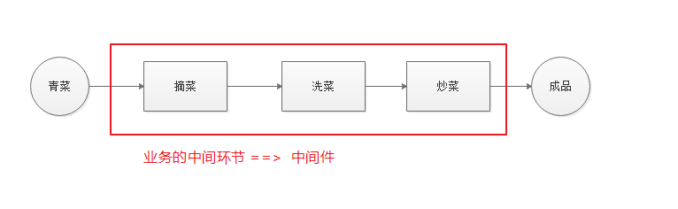

# 中间件

## 1.含义

中间件（middleware）可以理解为业务流程的中间处理环节。如生活中吃一般炒青菜，大约分为如下几步骤：


express中，当一个**请求到达的服务器之后，可以在给客户响应之前**连续调用**多个**中间件，来对本次请求和返回响应数据进行**处理**。


## 2.中间件的分类

中间件可以分类可分如下几类：

1. 内置中间件，也就是express本身自带无需npm安装

   - express.static()

2. 第三方中间件

   非 Express 官方内置的，而是由第三方开发出来的中间件，叫做第三方中间件。在项目中可以通过npm进行安装第三方中间件并配置，从而提高项目的开发效率。例如body-parser （解析post数据的）此中间件可以很方便帮助我们获取到post提交过来的数据。

3. 自定义中间件，开发者自己编写的（**中间件的本质其实就是一个function**）

如果从使用层面去考虑，中间件可以划分为：

1. 应用级别中间件（通过app.get/post/use等方法绑定到app实例的中间件）
   - 全局使用中间件（所有路由都生效）
     - app.use(中间件)
   - 局部使用中间件（当前路由生效）
     - app.请求方法(地址,[中间件.....,]回调函数)
     - app.请求方法(地址,中间件1,中间2,中间3......,]回调函数)
2. 路由级别中间件（绑定到express.Router()上的中间件）
   - 其用法与应用级别的中间件**没有任何区别**，只是一个绑在app实例上，一个绑在router上
     - router.use(中间件)
     - router.请求方法(地址,[中间件.....,]回调函数)

## 3.内置中间件

express提供了好用的内置中间件，如提供一个静态资源管理的中间件，通过此中间件就可以帮助为我们快速搭建一个静态资源服务器：

```javascript
app.use('前缀',express.static('托管目录地址'))
```

在express中，除了内置的`express.static()`中间件，还内置了另外2个常用的中间件：

- express.json
  - 作用：接收json格式提交的数据
  - 兼容性问题：express >= 4.16.0
  - `app.use(express.json())`
  - **其在接收完数据后，会将数据的对象形式挂载到`req`请求对象的`body`属性上**
- express.urlencoded
  - 作用：处理post表单数据
  - 兼容性问题：express >= 4.16.0
  - `app.use(express.urlencoded({extended: false}))`
  - **其在接收完数据后，会将数据的对象形式挂载到`req`请求对象的`body`属性上**

> 注意，
>
> - 后面提及的这2个常用内置中间件存在兼容性问题。express>=4.16.0
> - 上述2个中间件都说把数据处理之后挂到req.body上，但是实际上并不会出现我们想的覆盖的问题。

案例：使用json、urlencoded中间件来接收json数据与表单post数据，发送可以通过postman来进行

**需要注意，JSON数据数据名必须用双引号引起来，值如果是字符串的话也需要用双引号引起来，单引号不行！！！**

## 4.自定义中间件

自定义中间件，**其本质就是定义一个处理请求的函数**，只是此函数中除了有request和response参数外还必须包含一个next参数，此参数作用让中间件能够让流程向下执行下去直到匹配到的路由中发送响应给客户端。也可以通过给request对象添加属性来进行中间件数据的向下传递

```javascript
function mfn(req,res,next){ 
    //. 自己需要定义的逻辑流程
 // 中间件最后一定要执行此函数，否则程序无法向下执行下去
 next()
}
```

```javascript
function mfn(req,res,next){ 
    //. 自己需要定义的逻辑流程
 // 中间件最后一定要执行此函数，否则程序无法向下执行下去
 next()
}
```

> 注意：在整个请求链路中，**所有中间件与最终路由共用一份`req`和`res`**


**案例：依据上述的共用特性，自定义一个中间件来接收post提交的表单数据**（意义：内置那中间件是不是存在兼容性问题）

自己手动模拟一个类似于`express.urlencoded`这样的中间件，以解析post提交到服务器的表单数据。

步骤分析：

- 定义中间件（本质：函数）
- 监听req的data事件
  - 在中间件中，需要监听req对象的data事件来获取客户端发送到服务器的数据。如果数据量比较大，无法一次性发送完毕，则客户端会把数据切割后分批次发送给服务器。所以data事件可能会被触发多次，每次触发data事件时，收到的数据只是全部数据的一部分，因此需要做数据的拼接才能得到完整的数据。
- 监听req的end事件
  - 当请求体数据传输完毕后会触发end事件，拿到全部数据后可以继续处理post数据
- 使用querystring模块来解析请求体数据
- 将解析出来的请求体对象挂载到req.body上
- 将自定义中间件封装为模块（可选，建议做）
  - 为了优化代码的结构，我们可以把自定义的中间件函数封装成独立的模块

**实现代码:**

> 独立的自定义中间件模块：cs-body-parse

```javascript
// 引入querystring模块
const querystring = require("querystring")

// 核心代码
var csBodyParse = (req, res, next) => {
    let data = []
    req.on("data", (buffer) => {
        data.push(buffer)
    })
    req.on("end", () => {
        let post = querystring.parse(Buffer.concat(data).toString())
        // 挂载到req.body上
        req.body = post
        // 继续后续的请求处理
        next()
    })
}

// 导出
module.exports = csBodyParse
```

> 应用入口文件：app.js

```javascript
// 自定义中间件服务器文件（入口文件）
const express = require('express')
const app = express()
// 引入自己封装的中间件模块cs-body-parse
const csBodyParse = require('./modules/cs-body-parse')

// csBodyParse的使用
app.use(csBodyParse)

// 路由
app.post('/post',(req,res) => {
    console.log(req.body)
})

app.listen(3722,() => {
    console.log('Server is running at http://127.0.0.1:3722')
})
```

## 5.第三方中间件

在express中，其允许我们使用第三方的中间件来进行对数据进行处理。比较典型的例如：可以使用第三方中间件来接收post数据。

以使用`body-parser`中间件来接收post数据为例，步骤如下：

1. 安装三方中间件`body-parser`
   - `npm i -S body-parser`
2. 应用文件中导入`body-parser`

3. 通过中间件调用 `app.use(body.urlencoded({extended: false}))`

4. 在匹配的路由中通过`req.body`获数post中数据
   - Express内置的express.urlencoded中间件，就是基于body-parser这个第三方中间件进一步封装出来的。但内置的有版本兼容问题，所以一般项目选择安装使用第三方的中间件

> 在使用的时候，`body-parser`库的语法与前面看的express内置的`express.urlencoded`中间件的语法非常相似，原因是内置中间件是基于`body-parser`来实现的。

```javascript
const express = require('express')
const app = express()

// 引入body-parser
const bodyParser = require('body-parser')
// 使用body-parser中间件
app.use(bodyParser.urlencoded({ extended: false }));

app.post('/post',(req,res) => {
    console.log(req.body);
})

app.listen(3723,() => {
    console.log("Server is running at http://127.0.0.1:3723")
})
```

这个中间件已经弃用

新版写法：

- `app.use(express.json())`
- `app.use(express.urlencoded({extended: false}))`

## 6.错误类型中间件

### 6.1异常中间件

**作用：**专门用来捕获整个项目发生的异常错误，从而防止项目异常崩溃的问题产生（友好显示异常）。

**格式：**错误级别中间件的函数参数中，**必须有四个形参**，分别是`(err,req,res,next)`

问：多出来的err参数有什么作用呢？

答：里面包含了错误的信息，err.message属性中就包含了错误的文本信息，这个信息可以在中间件中输出给用户看。

**示例代码：**

```javascript
app.get('/',(req,res) => {
    throw new Error('服务器内部发生了致命的错误！')
    res.send('Welcome to my homepage')
})

app.use((err,req,res,next) => {
    console.log('发生了错误：' + err.message)
    res.send('Error！' + err.message)
})
```

**案例：**要求指定一个路径（可能路由对应的文件不存在），读取文件内容，输出给用户。正常的错误显示，既不友好，也不安全。需要处理

```js
// 引入需要的模块
const express = require('express')
const fs = require('fs')
const app = express()

// 路由
app.get('/',(req,res) => {
    let url = 'readme1.txt'
    // 读文件
    try{
        // 先去尝试一下读文件
        let data = fs.readFileSync(url)
        res.send(data)
    }catch(e){
        // 尝试失败，抛出异常
        throw new Error('文件读取失败')
    }
})

// 异常中间件
app.use((err,req,res,next) => {
    // 接受异常，继续处理异常
    res.send('ERROR：' + err.message)
})

// 启动服务器
app.listen(3724,() => {
    console.log("Server is running at http://127.0.0.1:3724");
})
```

> 注意事项：错误级别中间件要想发挥其作用，必须写在所有的路由的后面，是否是`app.listen`之前无所谓。

### 6.2 404处理

**作用：**用于处理404的请求响应

**示例代码:**

```javascript
// 假设定义这个路由，但是实际请求的时候请求了/12345，这个时候就会404
app.post("/1234", (req, res, next) => {
    res.send('你请求成功了')
});

// 404的输出
// 该中间件也需要写在最后（与异常中间件的顺序无所谓，只要确保其在所有的路由方法之后就可）
app.use((req,res,next) => {
    // 输出404错误
    res.status(404).send('<h1>404</h1>')
    // 先指定404状态码，然后再输出错误信息
})
```

> 404错误中间件也要求在所有的正常请求路由的后面去声明使用，**不要放在路由的前面，否则会导致后面的路由都是404错误。**

**注意点：**错误级别的中间件，必须在所有路由之后注册，至于404中间件与异常中间件，谁先谁后无所谓。

页面：<https://404.life/>

## 7.中间件的局部使用

- app.请求方法(地址,[中间件.....,]回调函数)
  - 3个参数
    - url，请求地址
    - 数组，多个中间件的集合
    - 回调函数，用于处理请求给出响应

```javascript
app.post('/',[express.json(),express.urlencoded({extended:false})],(req,res) => {
    
})
```

- app.请求方法(地址,中间件1,中间件2,.....,回调函数)
  - 至少3个参数，至多N+2（N为中间件的个数）

```javascript
app.post('/',express.json(),express.urlencoded({extended:false}),(req,res) => {
    
})
```

## 8.小结

在express中使用中间件时，需要注意以下几点：

- 在定义路由**之前**注册中间件（除了错误中间件）
- 一个请求中可以连续调用多个中间件
- 在一次请求链路中，多个中间件与最终路由方法中，他们共用一份`req`与`res`
- 每个中间件最后必须调用`next()`（除了错误中间件，必须要有参数传递）
- 不要在中间件的`next()`后继续写任何代码（没意义）
