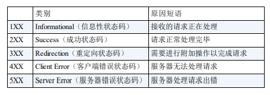

# HTTP 基础

书籍：《图解 HTTP》

>问题：当在浏览器地址栏输入 url 时，web 页面是如何呈现的？

web 页面使用 HTTP 协议作为规范，完成客户端（浏览器）和服务器端之间通信过程。

## 1.TCP/IP

为了了解 HTTP，有必要先了解下 TCP/IP 协议族。我们使用的网络包括互联网，都是 TCP/IP 协议族的基础上运行的，HTTP 属于 TCP/IP 内部的子集。

计算机和网络设备通信，双方必须基于相同的方法，或者说规则，这种规则称为协议。这种协议的总称叫做 TCP/IP。

> 也有说法 TCP/IP 是 TCP 和 IP 两种协议。

### 分层管理

TCP/IP 协议族采用分层管理：应用层、传输层、网络层、数据链路层。

1. 应用层：给用户提供服务。FTP 文件传输协议， DNS 域名系统，HTTP 协议属于该层。
2. 传输层：提供两台计算机数据传输。有TCP 和 UDP 两个协议。
3. 网络层：通过哪种路径传输数据。IP 属于网络层。
4. 链路层：处理连接网络的硬件部分。


发送端从应用层往下走，接收端从应用层往上走。

### IP、TCP、DNS

1. IP 负责传输数据。IP 是协议，IP 地址是被分配的地址，IP 地址可变。
2. TCP 确保可靠性。TCP 协议采用三次握手策略。

3. DNS 负责域名解析。计算机一般有 IP 地址和域名，IP 地址是长纯数字不便记忆，所以我们一般使用域名。DNS 专门用来转换域名和 IP 地址。

### 页面加载的过程

1. 浏览器查找域名对应的IP地址(DNS 查询：浏览器缓存->系统缓存->路由器缓存->ISP DNS 缓存->根域名服务器)
2. 浏览器向 Web 服务器发送一个 HTTP 请求（TCP三次握手）
3. 服务器 301 重定向（从 <http://example.com> 重定向到 <http://www.example.com>）
4. 浏览器跟踪重定向地址，请求另一个带 www 的网址
5. 服务器处理请求（通过路由读取资源）
6. 服务器返回一个 HTTP 响应（报头中把 Content-type 设置为 'text/html'）
7. 浏览器进 DOM 树构建
8. 浏览器发送请求获取嵌在 HTML 中的资源（如图片、音频、视频、CSS、JS等）
9. 浏览器显示完成页面
10. 浏览器发送异步请求

## 2.HTTP 请求


1. 前端应用从浏览器端向服务器发送 HTTP 请求(**请求报文**)
2. 后台服务器接收到请求后, 调度服务器应用处理请求, 向浏览器端返回 HTTP 响应(**响应报文**)
3. 浏览器端接收到响应, 解析显示响应体/调用监视回调

## 3.HTTP 请求报文

### 1.请求行

```js
method url
GET /product_detail?id=2
POST /login
```

### 2.多个请求头

```js
Host: www.baidu.com
Cookie: BAIDUID=AD3B0FA706E; BIDUPSID=AD3B0FA706;`
Content-Type: application/x-www-form-urlencoded 或者application/json
```

### 3.请求体

```js
username=tom&pwd=123
{"username": "tom", "pwd": 123}
```

### 4.请求报文

- 行：GET/URL/HTTP1.1
- 头：Host:Cookie:Content-type:User-Agent：
- 空行:
- 体:get请求为空，username=admin&password=admin

## 4.HTTP 响应报文

### 1.响应状态行

```js
status statusText
```

### 2.多个响应头

```js
Content-Type: text/html;charset=utf-8
Set-Cookie: BD_CK_SAM=1;path=/
```

### 3.响应体

```js
html 文本/json 文本/js/css/图片...
```

### 4.响应报文

- 行：HTTP/1.1  200（OK） 404（找不到） 403（被禁止）401（未授权）
- 头：content-type：content-length content-encoding
- 空行
- 体:HTML的内容

## 5.post 请求体参数格式

1. `Content-Type: application/x-www-form-urlencoded;charset=utf-8`
   用于键值对参数，参数的键值用=连接, 参数之间用&连接
   例如: `name=%E5%B0%8F%E6%98%8E&age=12`
2. `Content-Type: application/json;charset=utf-8`
   用于 json 字符串参数
   例如: `{"name": "%E5%B0%8F%E6%98%8E", "age": 12}`
3. `Content-Type: multipart/form-data`
   用于文件上传请求

## 6.常见的响应状态码

- `200 OK` 请求成功。一般用于GET 与POST 请求
- `201 Created` 已创建。成功请求并创建了新的资源
- `300` 重定向
- `401 Unauthorized` 未授权/请求要求用户的身份认证
- `404 Not Found` 服务器无法根据客户端的请求找到资源
- `500 Internal Server Error` 服务器内部错误，无法完成请求
- `503` 服务器没有运行



## 7.不同类型的请求及其作用

1. `GET`: 从服务器端**读取**数据（查）
2. `POST`: 向服务器端**添加**新数据 （增）
3. `PUT`: **更新**服务器端已经数据 （改）
4. `DELETE`: **删除**服务器端数据 （删）

## 8.API 的分类

1. REST API: restful （Representational State Transfer (资源)表现层状态转化）
   - 发送请求进行CRUD 哪个操作由请求方式来决定
   - 同一个请求路径可以进行多个操作
   - 请求方式会用到GET/POST/PUT/DELETE

2. 非REST API: restless
   - 请求方式不决定请求的CRUD 操作
   - 一个请求路径只对应一个操作
   - 一般只有GET/POST

## 9.区别一般 http 请求 与 ajax 请求

1. ajax 请求是一种特别的 http 请求
2. 对服务器端来说, 没有任何区别, 区别在**浏览器端**
3. 浏览器端发请求: 只有`XHR` 或`fetch` 发出的才是 ajax 请求, 其它所有的都是非ajax 请求
4. 浏览器端接收到响应
   - 一般请求: 浏览器一般会直接显示响应体数据, 也就是我们常说的刷新/跳转页面
   - ajax请求: 浏览器不会对界面进行任何更新操作, 只是**调用监视的回调函数**并**传入响应相关数据**

## 10.HTTP 协议

URL的组成：

- 协议://主机:端口/路径?查询
- scheme://host:port/path?query#fragment

HTTP协议，超文本传输协议，详细规定了浏览器和万维网服务器之间相互通信的规则。协议就是约定，规定。
