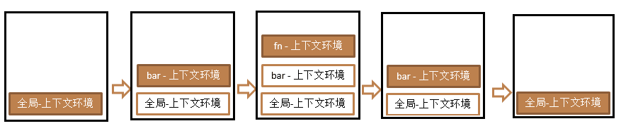
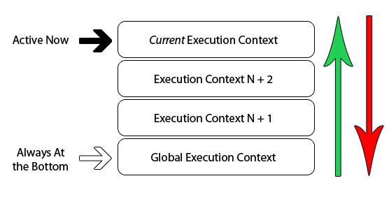

# 执行上下文与执行上下文栈

## 1.变量提升与函数提升

- 变量声明提升：通过var声明的变量，在定义语句前就可以访问到，值为undefined
- 函数声明提升：通过function声明的函数（**函数声明**），在之前就可以直接调用，值为函数对象
- **先执行变量提升再执行函数提升。**

## 2.执行上下文

执行上下文是当前代码的执行环境。

代码分为全局代码和局部（函数）代码。

执行上下文主要是三种类型：

- 全局执行上下文
- 函数执行上下文
- eval执行上下文，很少用

### 2.1.全局执行上下文

1. 在执行全局代码**前**，将**window**确定为**全局执行上下文**

```js
 //window
 var a1 = 1
 function a2(){
  console.log(2)
 }
```

2. 对全局数据进行预处理

- `var`定义的全局变量==》undefined，添加为window的属性

```js
    //window
 //window.a1 = undefined
    var a1 = 1
 function a2(){
  console.log(2)
 }
```

- `function`声明的全局函数==》赋值为function，添加为window的方法

```js
    //window
 //window.a1 = undefined
 //window.a2 = function(){}
    var a1 = 1
 function a2(){
  console.log(2)
 }
```

- `this`赋值为window

```js
    //window
 //window.a1 = undefined
 //window.a2 = function(){}
 //this = window
    var a1 = 1
 function a2(){
  console.log(2)
 }
```

3. 开始执行全局代码

**先执行变量提升再执行函数提升。**

### 2.2.函数执行上下文

1. 在调用函数时，准备执行函数体前，创建对应的函数的执行上下文对象

```js
 //1.window.fn = function(){.....}
 function fn(a1){
  var a2 = 2
  function a3(){
   console.log(3)
  }
 }
 fn(4)
```

2. 对局部数据进行处理

（1）形参变量==》赋值（实参）==》添加为执行上下文的属性

```js
    //1.window.fn
 //2.window.fn.a1 = undefined
 //3.window.fn.a1 = 4
 function fn(a1){
        //var a1 = undefined
        //a1 = 4
    }
 fn(4)
```

（2）arguments==》赋值（实参列表）==》添加为执行上下文的属性

```js
    //1.window.fn
 //2.window.fn.a1 = undefined
 //3.window.fn.a1 = 4
 //4.window.fn.arguments = [4]
    function fn(a1){
        //var a1 = undefined
        //a1 = 4
        //arguments = [4]
    }
    fn(4)
```

 （3）var定义的变量==》赋值为undefined==》添加为执行上下文的属性

```js
    //1.window.fn
 //2.window.fn.a1 = undefined
 //3.window.fn.a1 = 4
 //4.window.fn.arguments = [4]
 //5.window.fn.a2 = undefined
    function fn(a1){
        //var a1 = undefined
        //a1 = 4
        //arguments = [4]
        //var a2 = undefined
    }
    fn(4)
```

（4）function声明的函数==》赋值为function==》添加为执行上下文的属性

```js
    //1.window.fn
 //2.window.fn.a1 = undefined
 //3.window.fn.a1 = 4
 //4.window.fn.arguments = [4]
 //5.window.fn.a2 = undefined
 //6.window.fn.a3 = function(){...}
    function fn(a1){
        //var a1 = undefined
        //a1 = 4
        //arguments = [4]
        //var a2 = undefined
        //var a3 = function(){...}
    }
    fn(4)
```

（5）this==>赋值（调用函数的对象）

```js
    //1.window.fn
 //2.window.fn.a1 = undefined
 //3.window.fn.a1 = 4
 //4.window.fn.arguments = [4] 伪数组
 //5.window.fn.a2 = undefined
 //6.window.fn.a3 = function(){...}
 //7.this = window 赋值（调用函数的对象）
    function fn(a1){
        //var a1 = undefined
        //a1 = 4
        //arguments = [4]
        //var a2 = undefined
        //var a3 = function(){...}
    }
    fn(4)
```

3.开始执行局部代码

**验证：**

```js
    function fn(a1) {
        console.log(a1);//4
        console.log(a2);//undefined
        console.log(a3);//f a3(){...}
        a3()//3
        console.log(arguments);//arguments[4]
        console.log(this);//window
        var a2 = 2
        function a3() {
            console.log(3)
        }
    }
    fn(4)
```

**总结**：

- 每调用一次函数，就会有一个函数执行上下文。

- **n+1个执行上下文，n代表调用函数的次数，1代表window**

## 3.执行上下文栈

```js
<script>    
  //1.进入全局执行上下文
    var a = 10
    var bar = function (x) {
        var b = 5
        fn(x + b) //3.进入fn执行上下文
    }
    var fn = function (y) {
        var c = 5
        console.log(a + c + y)
    }
    bar(10)//2.进入bar执行上下文
</script>
```

**代码运行时，会有很多的执行上下文，执行上下文栈用来管理执行上下文。**



**栈：后进先出**

1. 在执行上下文前，JS会创建一个栈来管理所有的执行上下文对象。
2. 在全局执行上下文（window）确定后，加入栈中（压栈）
3. 函数执行上下文确定后，加入栈中压栈
4. 当前函数执行完后，将栈顶的对象移除（出栈）
5. 当前所有的代码执行完后，栈中还剩下window



## 4.递归调用

递归调用的特点

- 在函数内部调用自己
- 一般会有return返回值退出循环
